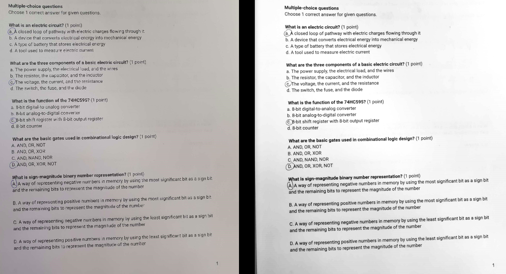

# paper-scans-to-pdf

## Description
Taking bunch of written papers, assignments, exams and converting them to single large PDF.
This PDF can be imported into digital notepads, notebooks, tablets, and be 
graded as actual paper examination.

**Image optimization for e-ink display**

## TODO
> Add PDF cutter/splitter
 - Input: array [Name, start page, end page]
 - Output: folder with bunch of PDFs cut per student, named accordingly

## Usage
1. Add images to ./data folder
2. Add images to ./data folder (png, jpg, jpeg, ...)
3. run ./convert.sh
4. Open compiled.pdf
